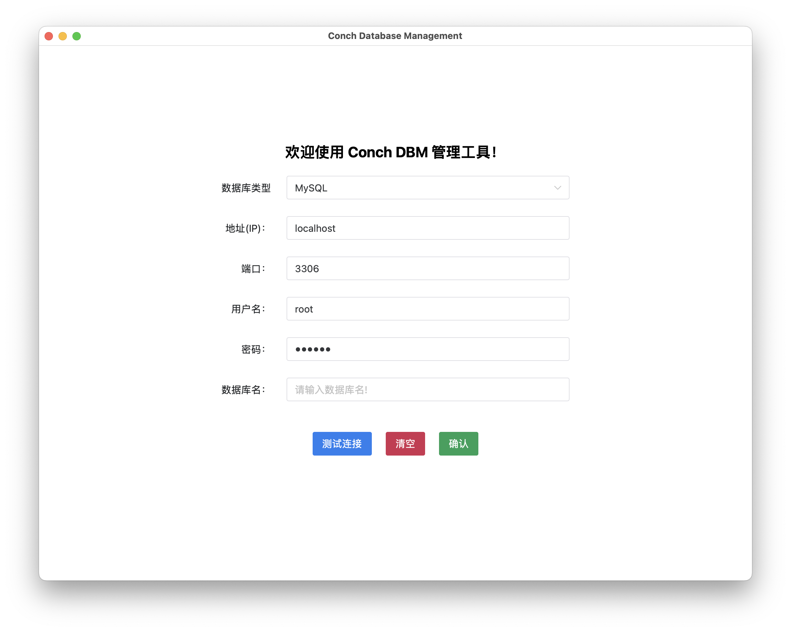

# 🐚ConchDBM 桌面端轻量级跨平台数据库管理工具

## 项目介绍

ConchDBM（Conch Database Management） 是一款基于 Golang 语言、Wails 框架、Vue 前端框架开发的一款桌面端轻量级跨平台数据库管理工具。



## 功能特性

- 🎈使用 Wails 框架，基于 WebView2，无内嵌浏览器内核，真正实现了轻量级
- 🎊Windows、Mac、Linux 的 X86、ARM 均可安装使用，真正做到了跨平台
- 🎉可连接 MySQL、Oracle、Redis 等主流数据库

## 安装

本项目提供 Windows、Mac、Linux 下 X86、ARM 两种版本，基本覆盖了目前所有的主流设备。

### 下载安装

// TODO : Release 待更新

### 编译构建

1. 克隆仓库到本地

```shell
git clone https://github.com/CoderMast/ConchDBM.git
```

2. 开始编译构建

```shell
wails build -platform [os/arch]
```

> 把这里的 os 换成你自己的操作系统名称，arch 换成你电脑的指令集版本，并且去掉中括号，具体的操作系统名称和架构类型参考 Wails 官方文档。
> ```shell
> wails build -platform drawin/arm64
> ```

3. 编译完成即可在 build/bin 目录中找到对应的软件包，打开运行即可。


> 编译安装之前，请确保你成功安装好了 Golang、Wails、Node.js 等一系列环境，否则在运行过程中可能会出现无法预料的问题。

## 关于

本项目完全开源，且免费公开，如果您对本项目感兴趣，欢迎提交 Pull Request，非常欢迎！